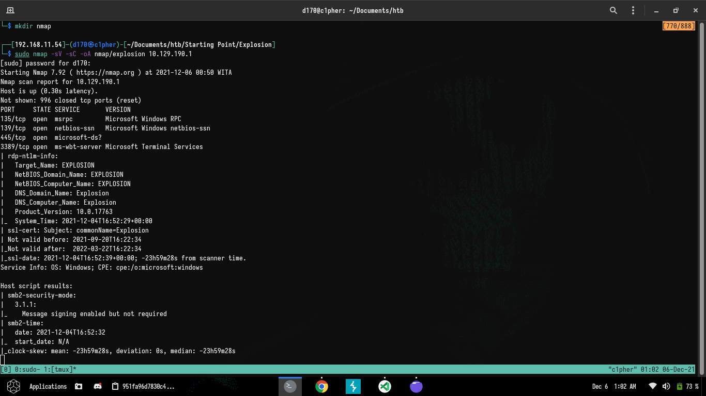
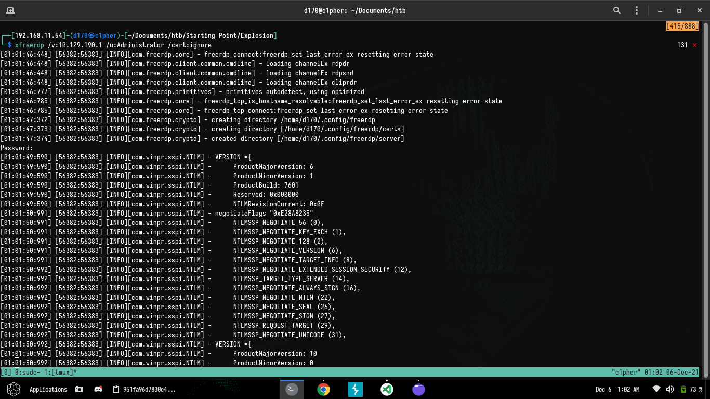
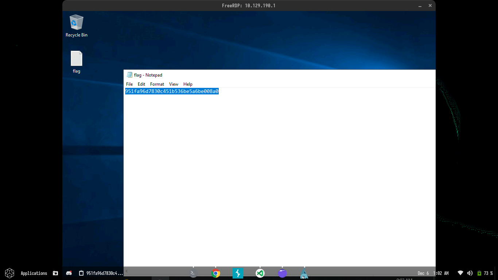

# Write Up Starting Point

## Challenge - explosion

### Tentang Challenge

- Introduction

  Mempelajari basic dasar protocols RDP (Remote Desktop Protocol).

1. Task One

   > What does the 3-letter acronym RDP stand for?

   > Answer : `Remote Desktop PRotocol`

2. Task Two

   > What is a 3-letter acronym that refers to interaction with the host through a command line interface?

   > Answer : `cli`

3. Task Three

   > What about graphical user interface interactions?

   > Answer : `gui`

4. Task Four

   > What is the name of an old remote access tool that came without encryption by default?

   > Answer : `telnet`

5. Task Five

   > What is the concept used to verify the identity of the remote host with SSH connections?

   > Answer : `public-key cryptography`

6. Task Six

   > What is the name of the tool that we can use to initiate a desktop projection to our host using the terminal?

   > Answer : `xfreerdp`

7. Task Seven

   > What is the name of the service running on port 3389 TCP?

   > Answer : `ms-wbt-server`

8. Task Eight

   > What is the switch used to specify the target host's IP address when using xfreerdp?

   > Answer : `/v:`

9. Submit Flag

   > Submit root flag

   > Answer : `HTB{951fa96d7830c451b536be5a6be008a0}`

### Proof Of Concept :

- Enumeration
  - scan port target menggunakan command [`sudo nmap -sV -sC -oA nmap/dancing (IP)`](./nmap)
    
  - login ke rdp target menggunakan command `xfreerdp /v:{target_IP} /u:Administrator /c:ignore`  dengan default login authentication.
  - get flag.txt
    
